# Genomic Dashboards
This document is designed to identify commonly used dashboard elements to improve situational awareness and provide a better understanding of geospatial and temporal patterns arising from SARS-CoV-2 genomic data sources. This document serves as an introduction to elements, focusing on SARS-CoV-2 genomic data, with simple examples using open source technologies.

## Table of Contents
> - [Numeric Counts](#1-numeric-counts)
> - [Maps](#2-maps)
> - [Epidemiologic Curves](#3-epidemiologic-curves)
> - [Variants over Time](#4-variants-over-time)
> - [Tables](#5-tables)
> - [Interaction and Filtering](#6-interaction-and-filtering)

### 1. Numeric Counts

Numeric counts are often highlighted on a dashboard and frequently populate the upper- or left-most portion of the dashboard. These counts can represent totals of tests administered, cases, hospitalizations, deaths, and vaccinations. To draw the user's attention to these counts, they are often large, colorful, and/or accompanied by relevant icons.

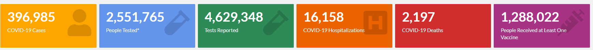

> Above is an example of dashboard counts from the [Utah Department of Health's COVID-19 Case Count Dashboard](https://coronavirus.utah.gov/case-counts/)

***

In a genomic sequencing context, these metrics typically relate to the total number of SARS-CoV-2 genomes sequenced, the proportion of cases in a geographic region that have been sequenced, or the total number of sequences since a landmark point in time.

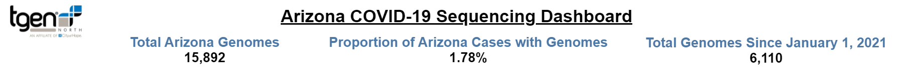
> Above is an example of counts on a [SARS-CoV-2 sequencing dashboard](https://pathogen.tgen.org/covidseq-tracker/) developed by TGEN for the state of Arizona

It may be helpful to treat numeric counts as headers that appear at the top of multiple dashboard views because they provide additional context and a reference point from which to compare other charts, maps, or figures.

***

While an advanced technique, it can be helpful to augment these metrics with indicators of recent trends, as shown below.
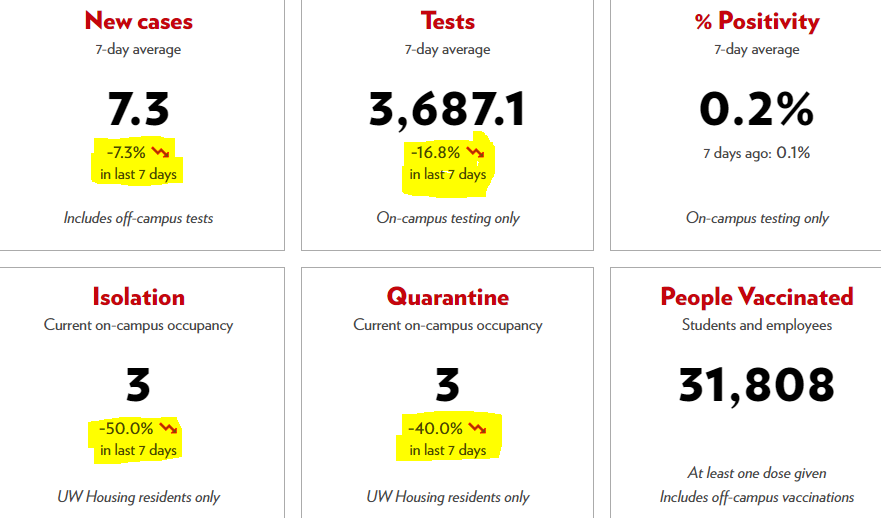
> Above shows 7-day average counts of numerous variables taken from data collected at the University of Wisconsin-Madison and available on the [COVID-19 Response-UW-Madison Dashboard](https://covidresponse.wisc.edu/dashboard-2021-jan-may/), with percentage trends indicated by numbers and arrows

### 2. Maps

A common feature to most SARS-CoV-2 tracking dashboards are choropleth maps, or maps where regions are colored according to a variable of interest. For example, variables shown in the tooltip, a text box that displays information when the user hovers over the area, often included onto a map often include the case incidence rates or cumulative counts per rolling time window, the proportion of cases where genomes are sequenced, or the number of variants of concern. They can be used to show these values on existing jurisdictional boundaries (e.g., states or counties) or custom areas (e.g., health regions or a “tri-county” area).

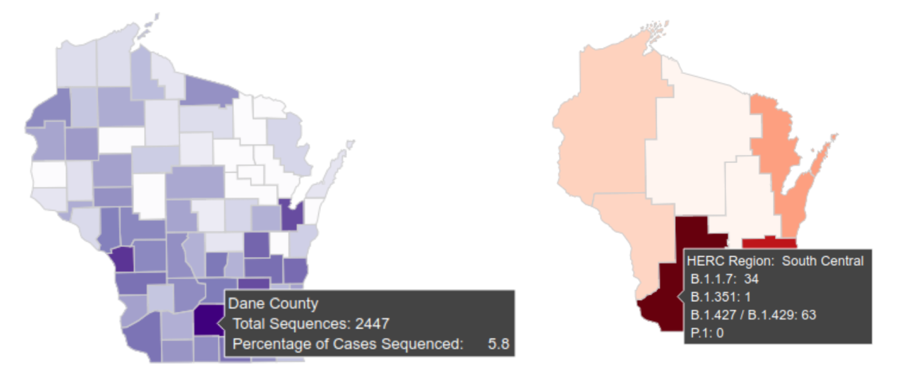

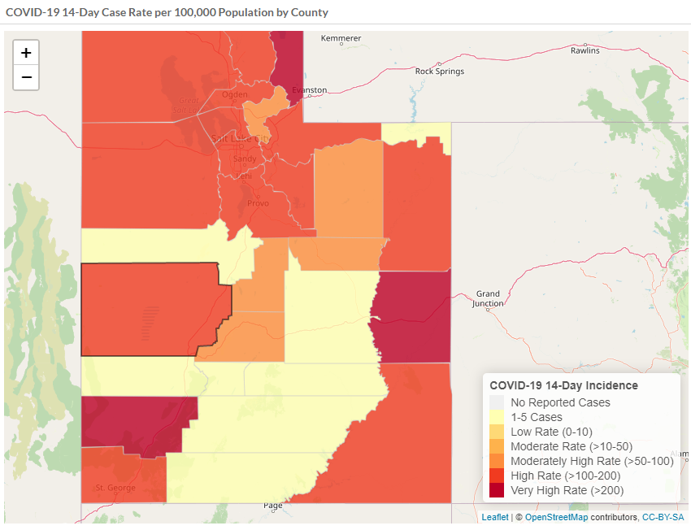

> Above are examples of standard jurisdictions with case counts and sequencing percentages (top-left), custom jurisdictions showing variant counts by for each region (top-right), and incidence rates over a 14-day rolling window, expressed in cases per 100,000 population by county (above). Utah Department of Health's COVID-19 Case Count Dashboardhttps://coronavirus.utah.gov/case-counts/.

Maps can display information about variants of concern in a variety of ways. These may include lists of variants and counts, as shown above. Another option is to overlay pie charts that denote the proportion of variant types within a particular geographic region, as shown below.

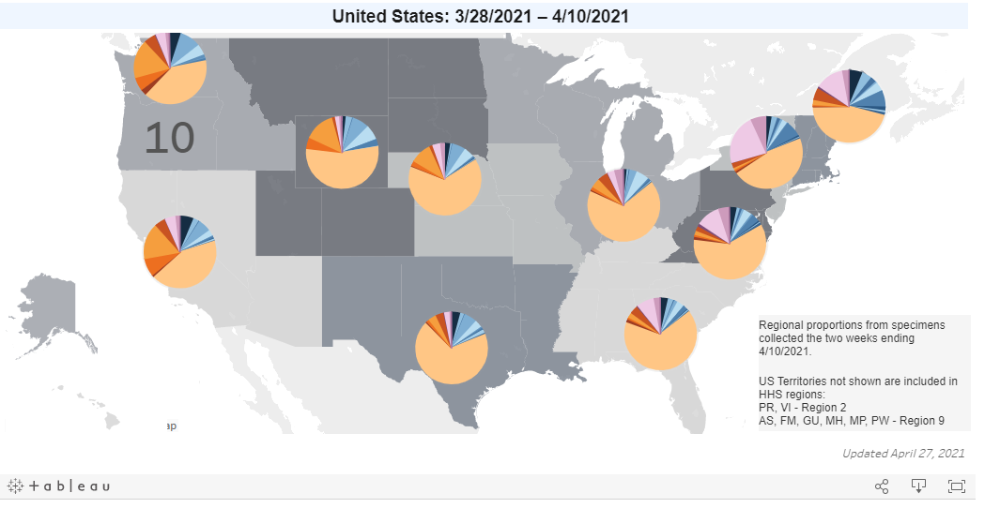

> Above is a map found in the [CDC COVID Data Tracker](https://covid.cdc.gov/covid-data-tracker/#variant-proportions) showing the distribution of SARS-CoV-2 pango lineages as pie chart overlays. Note that it uses custom HHS Regions as an aggregation step to prevent overplotting.

Next, we show that same map, but filtered by HHS Region 1, enabling the user to focus on a region of interest.

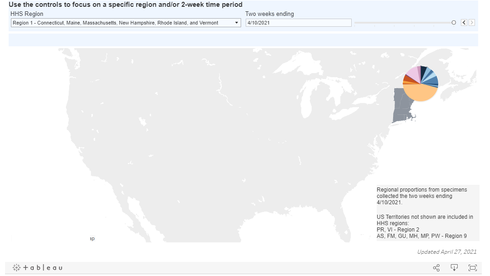
> Above is the same map found in the [CDC COVID Data Tracker](https://covid.cdc.gov/covid-data-tracker/#variant-proportions) showing the distribution of SARS-CoV-2 pango lineages as pie chart overlays, however, this map has been filtered to show only HHS Region 1, encompassing on the New England area.

Finally, it is important to note that the most recent data may be unreliable for prediction and trend analysis due to small sample size. Ideally, identifying a point where data are more reliable due to increased sequencing capacity may be necessary. In the example shown below, the sampling density is aligned such that a user can consider the sampling frequency for the period under evaluation.

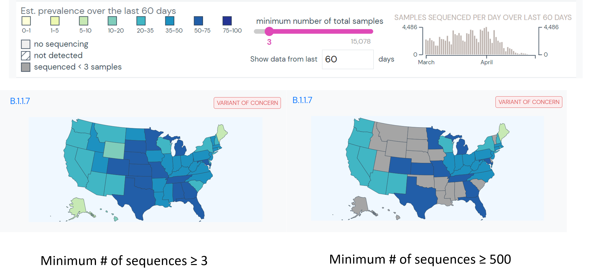

> Above are two maps, filtered according to two different sampling densities (>=3 on the left, >=500 on the right) for Variant of Concern: B.1.1.7. Increasing the sampling density threshold will help to minimize chaotic deviations in the underlying data. These maps are found in the [CDC COVID Data Tracker](https://covid.cdc.gov/covid-data-tracker/#variant-proportions).

### 3. Epidemiologic Curves

Epidemiologic curves, typically referred to as epi curves, are a staple of any public health investigation. These visualizations show counts of a metric over a period of time, typically broken out into daily, weekly, or monthly bins. These visualizations are subject to periodic, weekly cycles in counts. To overcome the variability introduced by weekly cycles, a 7-day rolling average is commonly overlaid. Given that this is a rolling average, it will seem slightly offset from the underlying bar plot.

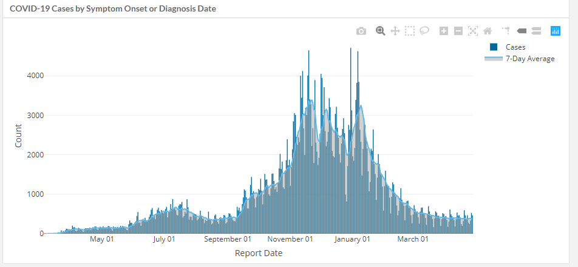

> Above is an example of epidemiologic curves displayed on [Utah Department of Health's COVID-19 Case Count Dashboard](https://coronavirus.utah.gov/case-counts/).

These visualizations can be further customized with colors to overlay additional categorical variables onto an epidemiologic curve, be they clinical or demographic.

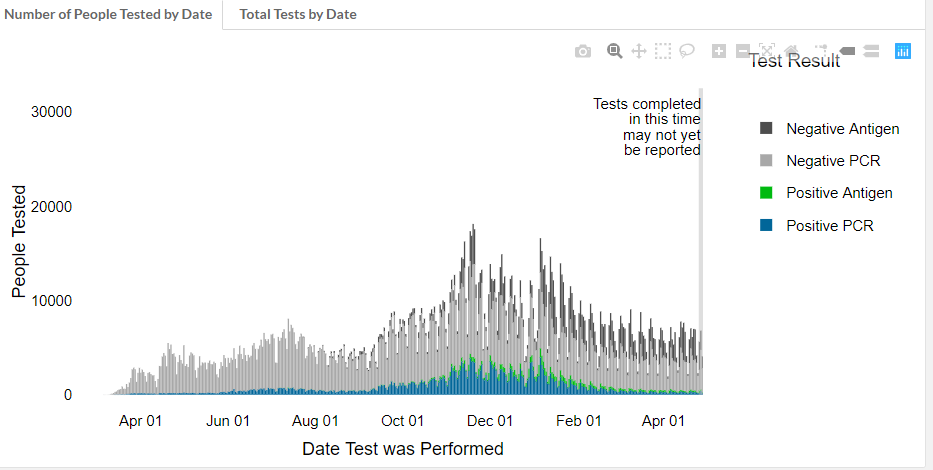
> Above is an example of epidemiologic curves that have been colored by a categorical variable for addition context. This figure is displayed on [Utah Department of Health's COVID-19 Case Count Dashboard](https://coronavirus.utah.gov/case-counts/).

### 4. Variants over Time

As the SARS-CoV-2 pandemic continues, focus has shifted to tracking the prevalence of particular variants over time and categorizing them as Variants of Interest (VOIs) or Variants of Concern (VOCs). The ability to track the change in frequency over time is of fundamental importance to this surveillance effort, and how those data are visualized can vary.

The most common means of visualizing variant proportions over multiple time points is a stacked bar chart. Each bar represents a particular unit of time, broken down by the proportion of variants identified during that period, with the most prevalent variants (often >=5%) labeled for clarity. Multiple time points are then represented as discrete, adjacent bars. While helpful, this view is particularly hard to compare with quantitative precision because bars do not align from one time point to the next. To aid interpretation by the reader, it is helpful to accompany a stacked bar chart with specific metrics. These can come in the form of an adjacent table, as shown below, or an interactive tool-tip that displays more information when the mouse is hovered over a region of interest in the stacked bar chart.

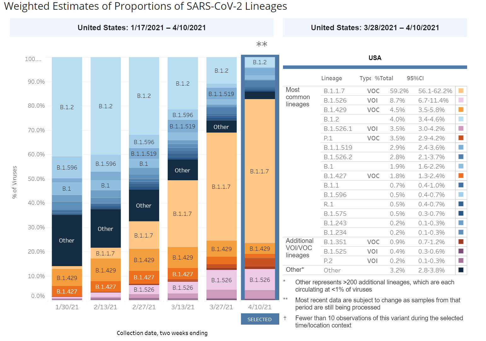

> Above is an example of a refined way to display variants over time, developed by the CDC and available at the [Variant Proportions](https://covid.cdc.gov/covid-data-tracker/#variant-proportions) subsection of the [CDC COVID Data Tracker](https://covid.cdc.gov/covid-data-tracker/#datatracker-home).

In the figure above, there are a number of subtle cues and interactive layers that provide additional context and detail to the reader. For example:
* The most recent two-week span is:
    1. highlighted with a bold selection border to focus the attention
    2. marked with a double-asterisk to denote that it is subject to change due a to sample collection and processing delay
* Only the most prevalent variants are labeled with text to prevent overplotting
* The stacked bar chart is accompanied by a color-matched table to help provide additional detail, such as estimated proportions and confidence intervals

There are alternative visualizations that depict continuous time, rather than cutting the dataset up into discrete time bins. One prominent example of this are the variants tracking visualization powered by Nextstrain, shown below. This methodology enables visual tracking of variant frequency over time at the cost of comparative metrics offered by discrete time bins.

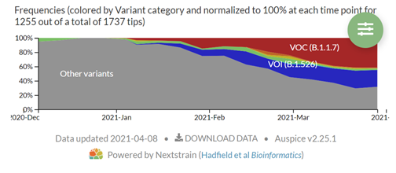

> Above is an example of an integrated, smoothed view of variants over time produced by Nextstrain and integrated with the [Connecticut COVID Tracker](https://covidtrackerct.com/variant-surveillance/ )

As with maps, it is important to note that the array of Variants of Interest (VOIs) and Variants of Concern (VOCs) that are under surveillance will continue to grow and their frequencies will vary over time. Therefore, stacked bar charts can rapidly become complex and difficult to track. One way to combat information overload is to build interactive features and filters that empower users and analysts to focus on the most critical values and patterns in the visualization.

### 5. Tables

Tables are typically used on dashboards as a secondary visual to provide details and context to a primary visual, as shown above in the [Variants over Time](#4-variants-over-time) section. Tables, like the one shown below depicting variant frequencies in Washington State, are a staple format for epidemiological reports about public health investigations.

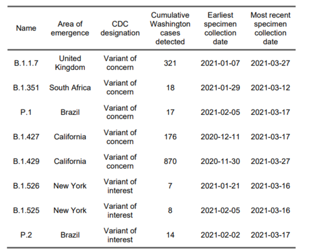

***

Tables can also be used to provide very granular information broken out by a number of variables, such as a cross-tabulation of variants by county like the one shown below, also from Washington State.

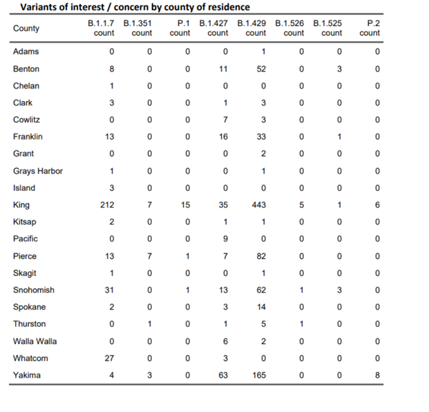
> Above is a county-level cross tabulation of VOIs and VOCs, which can be helpful in digging through very granular data. Tables are an ideal companion visualization to provide context for a broad visualization (as identified on the [Variants over Time](#4-variants-over-time) section).

### 6. Interaction and Filtering

 Dashboards are typically designed to provide a near real-time view of a variety of data, and their performance can vary dramatically depending on the scale of the underlying data set. For example, when too much information is shown they can fall victim to 'overplotting'. Overplotting describes when data or labels in a visualization overlap, making it difficult to see individual data points or patterns. Overplotting typically occurs with a large number of data points or a small number of unique values.

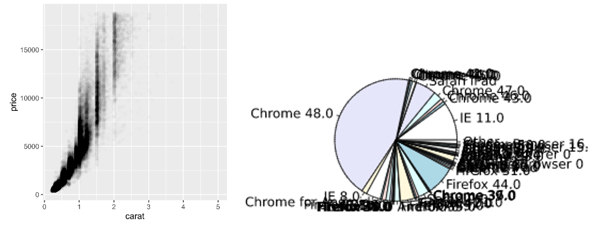

> Above are two examples of overplotting. First, a dot plot that has an overwhelming number of data points shown that is difficult to read. Second, a pie chart where each wedge is labeled thus causing labels to obscure the data.

Fixes for overplotting include reducing the size of points, changing the shape of points, jittering, tiling, making points transparent as shown above, only showing a subset of points, and using algorithms to aggregate, cluster, or even prevent labels from overlapping.

***
Case Study: [Johns Hopkins COVID-19 Map](https://coronavirus.jhu.edu/map.html)

As the COVID-19 pandemic progressed and became more widespread, the Johns Hopkins Coronavirus Resource Center's cumulative dashboard that was useful early on was rendered useless for analytic purposes due to overplotting. Below, you’ll see that the map visualization better represents population distributions and political jurisdictional boundaries than the progress of the pandemic.

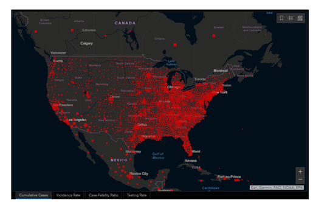

JHU responded by generating a more detailed heatmap visualization that is released in video format once per day. These videos effectively act as a rapid but effective walkthrough of multiple dashboard elements in a short period of time.

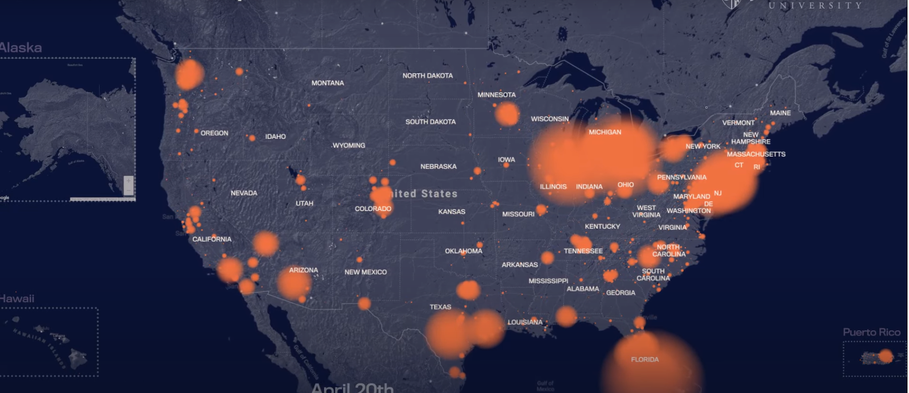
> Above is a screen capture of the [Johns Hopkins University's Daily COVID-19 Video](https://coronavirus.jhu.edu/covid-19-daily-video) captured on April 29th, 2021.

Variants of Interest/Concern will vary dynamically over time, and so it may be ineffective to report all variant and frequencies at all times. Rather, it may be most useful to report variants according to a rule, such as:
1. Report only the top 10 variants
2. Report all variants above a certain threshold (1%, 5%, etc.)

It may be helpful to provide additional filtering parameters or graphical context to the reader to describe sequencing capacity for the period of time or region under evaluation. The figure shown below enables report-level filtering based on user input.

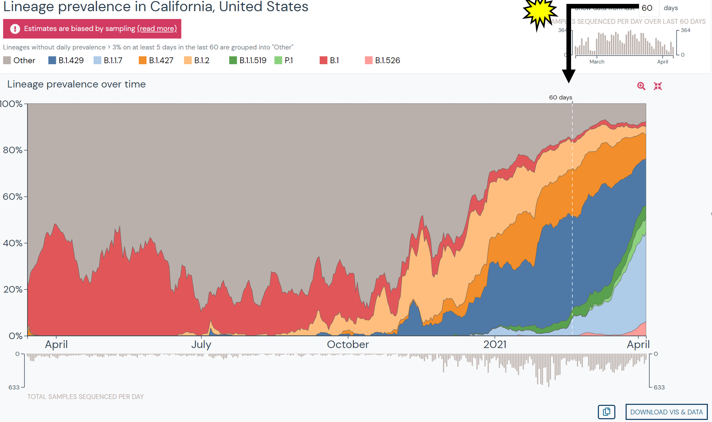
> Above is an example of visualization provided by [Outbreaks.Info](https://outbreak.info) in their Region Report focused on the United States.
